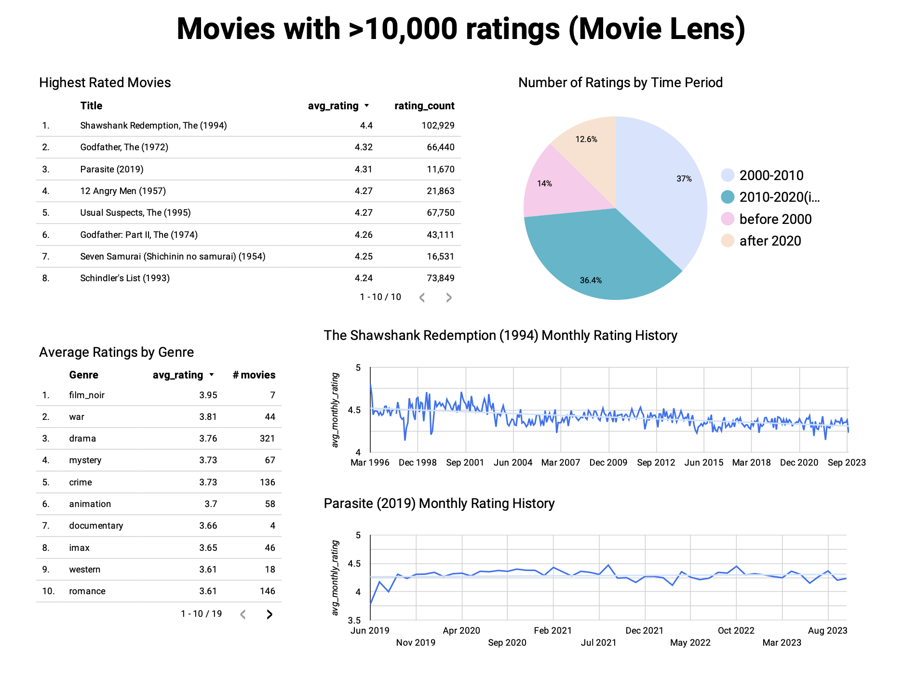
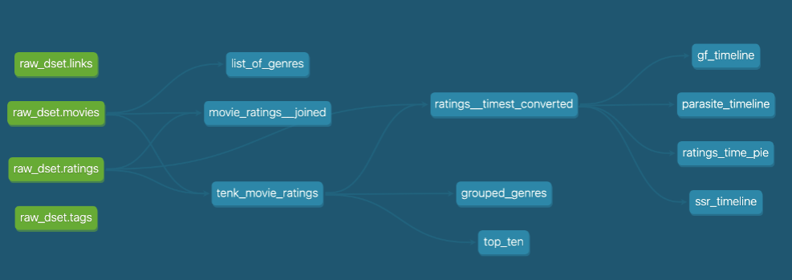

# An ETL Pipeline -- Personal Project 
A simple end-to-end Extract Load Transform (ELT) Pipeline for a [movie dataset](https://files.grouplens.org/datasets/movielens/ml-32m.zip)
 from MovieLens / GroupLens.

Provision Infrastructure -->  Extract -->  Load  -->  Transform  -->  BI/Viz.

Tools:
- Infrastructure as Code: 
    - Terraform
- Orchestration: 
    - Kestra
- Data Lake: 
    - Google Cloud Storage (GCS)
- Data Warehouse
    - Google BigQuery
- Transformation: 
    - dbt
- BI / Viz: 
    - LookerStudio

## 📊 Looker Studio Dashboard
The dashboard file is `dashboard.png`.

📌 **Preview the Dashboard Below** ⬇️

> The Shawshank Redemption (1994) is the highest rated among popular movies (>10,000 ratings).

## Steps to reproduce
- 1 Connect your machine to google cloud
    - `gcloud auth login`
    - `gcloud config set project \[YOUR_PROJECT_ID\]`
    - `gcloud auth application-default login`
- 2 Provision infrastructure (storage bucket and empty bigquery dataset)
    - open terraform folder `cd terraform-gcp-infra` 
    - `terraform init`
    - `terraform apply -var="project_id=\[YOUR_PROJECT_ID\]" -var="bucket_name=\[YOUR_BUCKET_NAME\]"`
- 3 Download, extract, and ingest data to GCS then to bigquery
    - open kestra-orchestration folder
    - set up your account in `gcp_kv_template.yaml`
    - spin up kestra `docker compose up -d`
    - run the following flows in kestra:
    - `gcp_kv.yaml`
    - `extract_load.yaml`
    - `gcs_to_bigquery.yaml`
- 4 Transform data with dbt
    - open dbt-transformations folder
    - configure local virtual environment for `dbt-core` and `dbt-bigquery`, here we can do `uv sync` if you have installed `uv`
    - set up connection between local dbt project and BigQuery `~/.dbt/profiles.yml`
    - go to the dbt-transformations/movie-lens folder and do `dbt build` to apply the transformations
- 5 LookerStudio data sources (tables)
    - Highest rated movies table: `analytics/top_ten`
    - Average ratings by genre table: `analytics/grouped_genres`
    - Number of rating by time period pie chart `analytics/ratings_time_pie`
    - Time Series: `analytics/ssr_timeline`, `analytics/parasite_timeline`
- 6 Clean up resources
    - `terraform destroy -var="project_id=\[YOUR_PROJECT_ID\]" -var="bucket_name=\[YOUR_BUCKET_NAME\]`
    - remove remaining staging and analytics datasets from bigquery.

## dbt DAG

From raw datasets (left) to final tables.

# Original MovieLens Dataset Readme
### Summary

This dataset (ml-32m) describes 5-star rating and free-text tagging activity from [MovieLens](http://movielens.org), a movie recommendation service. It contains 32000204 ratings and 2000072 tag applications across 87585 movies. These data were created by 200948 users between January 09, 1995 and October 12, 2023. This dataset was generated on October 13, 2023.

Users were selected at random for inclusion. All selected users had rated at least 20 movies. No demographic information is included. Each user is represented by an id, and no other information is provided.

The data are contained in the files `links.csv`, `movies.csv`, `ratings.csv` and `tags.csv`. More details about the contents and use of all these files follows.

This and other GroupLens data sets are publicly available for download at <http://grouplens.org/datasets/>.

### Usage License

Neither the University of Minnesota nor any of the researchers involved can guarantee the correctness of the data, its suitability for any particular purpose, or the validity of results based on the use of the data set. The data set may be used for any research purposes under the following conditions:

* The user may not state or imply any endorsement from the University of Minnesota or the GroupLens Research Group.
* The user must acknowledge the use of the data set in publications resulting from the use of the data set (see below for citation information).
* The user may redistribute the data set, including transformations, so long as it is distributed under these same license conditions.
* The user may not use this information for any commercial or revenue-bearing purposes without first obtaining permission from a faculty member of the GroupLens Research Project at the University of Minnesota.
* The executable software scripts are provided "as is" without warranty of any kind, either expressed or implied, including, but not limited to, the implied warranties of merchantability and fitness for a particular purpose. The entire risk as to the quality and performance of them is with you. Should the program prove defective, you assume the cost of all necessary servicing, repair or correction.

In no event shall the University of Minnesota, its affiliates or employees be liable to you for any damages arising out of the use or inability to use these programs (including but not limited to loss of data or data being rendered inaccurate).

If you have any further questions or comments, please email <grouplens-info@umn.edu>

### Citation

To acknowledge use of the dataset in publications, please cite the following paper:

> F. Maxwell Harper and Joseph A. Konstan. 2015. The MovieLens Datasets: History and Context. ACM Transactions on Interactive Intelligent Systems (TiiS) 5, 4: 19:1–19:19. <https://doi.org/10.1145/2827872>

